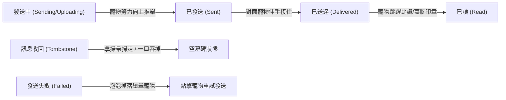

# 寵物與聊天訊息泡泡互動設計參考指南 (Pet & Message Bubble Interaction Reference)

> **文件定位**：專案參考規範（Reference Document）。作為虛擬寵物（`PetWorldOverlay`）與聊天室訊息氣泡（`Message Bubble`）之互動機制、視覺物理表現、情緒感知、遊戲化及 Flutter 技術落地之長期核心備忘錄。

---

## 1. 核心設計哲學 (Core Philosophy)

1. **氣泡即舞台，寵物即陪伴者**：
   訊息氣泡不僅僅是文字容器，更是寵物在聊天室內的實體地貌（地形、玩具、道具）。寵物透過在氣泡間跑、跳、趴、玩，將冰冷的通訊轉化為生動的情感體驗。
2. **非侵入性與趣味平衡（Non-intrusive Delight）**：
   - 互動不得阻擋閱讀核心內容（如長文內容不被大面積遮蔽）。
   - 寵物動作應具備自然物理過渡，避免頻繁瞬移或干擾使用者打字與快速滾動。

---

## 2. 五大互動維度與設計模式 (Interaction Dimensions)

### 維度一：物理與空間動態（Physical & Spatial Dynamics）

將訊息氣泡視為具備剛體、重力與彈性的物件：

| 模式名稱 | 觸發條件 | 視覺與物理表現 | 情感反饋 |
| :--- | :--- | :--- | :--- |
| **長文棲息趴睡 (Perch & Nap)** | 泡泡高度超過一定閥值（長訊息） | 寵物輕盈躍上泡泡頂端平坦處趴下，伴隨呼嚕聲打瞌睡、晃尾巴 | 溫馨、陪伴 |
| **懸掛晃腳 (Hang & Swing)** | 短訊息或懸空較高的氣泡 | 寵物兩隻前爪緊抓泡泡下緣，身體懸空悠閒晃腳 | 俏皮、放鬆 |
| **頂球與推擠 (Push & Bump)** | 發送新訊息時 | 寵物用鼻尖或額頭將新生成的小氣泡「頂」入對話流，具備彈簧回彈效果 | 活力、參與感 |
| **彈簧拉扯 (Elastic Tug)** | 使用者長按或拖曳氣泡 | 寵物咬住氣泡另一角往反方向拉扯，放手時氣泡像果凍般震動復原 | 趣味、互動感 |
| **躲貓貓偷瞄 (Peek & Hide)** | 連續大圖、影片或寬幅氣泡 | 寵物躲在氣泡背面，僅探出耳朵或半張臉偷瞄使用者 | 害羞、呆萌 |
| **氣泡戳破 (Popping Effect)** | 限時閱讀/閱後即焚訊息到期 | 寵物伸出肉球爪子「啪」地一聲拍破氣泡，伴隨細微星光碎屑特效 | 驚喜、解脫 |

---

### 維度二：語意與情緒共鳴（Semantic & Emotional Resonance）

前端或輕量分析引擎捕捉關鍵字與語氣，使寵物產生「即時讀懂」的擬人化反應：

1. **食物關鍵字彩蛋（Food Keywords）**：
   - **觸發字**：「吃飯」、「肉泥」、「罐罐」、「肚子餓」、「宵夜」
   - **反應**：寵物雙眼發光（冒星星）、嘴角流口水，嘴裡叼著小空碗快速奔跑到該訊息泡泡旁狂蹭求餵食。
2. **誇獎與親密彩蛋（Praise & Affection）**：
   - **觸發字**：「好乖」、「愛你」、「太棒了」、「寶貝」、「摸摸」
   - **反應**：寵物在該氣泡旁原地轉圈、翻肚子撒嬌，頭頂冒出漸顯漸消的粉紅愛心粒子。
3. **玩具與指令彩蛋（Play & Commands）**：
   - **觸發字**：「雷射筆」、「逗貓棒」、「毛線球」、「去接球」
   - **反應**：畫面上短暫出現紅點或滾動的球，寵物在對話清單的複數泡泡之間快速穿梭追逐。
4. **情緒感知與心靈安慰（Sentiment Comfort）**：
   - **觸發字**：「難過」、「好累」、「哭了」、「傷心」、「😭」、「🥺」
   - **反應**：寵物耳朵垂下，緩步走到該泡泡旁，用臉頰緊緊貼著文字泡泡，釋放暖色微光，給予溫柔陪伴。
5. **無聊與催促反饋（Idle Timeout）**：
   - **觸發條件**：聊天室停留超過 3 分鐘無新訊息產生。
   - **反應**：寵物坐在最後一個氣泡上打大哈欠、托腮數羊，或偶爾敲擊螢幕像在說「主人怎麼安靜了？」。

---

### 維度三：訊息生命週期與狀態聯動（Lifecycle State Reflection）

將技術狀態（發送中、失敗、已讀、收回）轉譯為生動的寵物肢體語言：



1. **發送中（Sending）**：
   - 泡泡由半透明上升，寵物在泡泡底部雙手托舉、用力往上推，取代冰冷的旋轉進度環。
2. **發送失敗（Failed）**：
   - 泡泡像鉛塊般「咚」地掉下來把寵物壓扁或砸暈，頭頂冒出旋轉星星；**使用者點擊寵物即可觸發 Retry（重試發送）**。
3. **已讀回條（Read Receipt）**：
   - 當遠端已讀狀態確認時，寵物耳朵動一下，躍起在泡泡角落蓋上一個肉球印記。
4. **訊息撤回 / Tombstone 墓碑**：
   - 當訊息被刪除/標記墓碑時，寵物拿出一把小掃帚把氣泡「唰唰」掃出螢幕外；或者張大嘴巴一口把泡泡「吃掉」然後滿足打飽嗝。

---

### 維度四：雙向與多寵社交（Cross-Pet Multi-Room Social）

在雙人或群組聊天情境下，不同使用者的寵物在共同畫面上產生互動：

1. **接力傳球（Relay Delivery）**：
   - 發送方寵物將訊息氣泡像踢足球般踢過聊天室中線；接收方寵物在另一側精準接住。
2. **搶泡泡拔河（Bubble Tug-of-War）**：
   - 當雙方同時熱烈發話時，兩隻寵物在最新訊息兩端咬住泡泡互不相讓，直到下一則訊息到來。
3. **偷看對方的輸入提示（Typing Spy）**：
   - 當對方正在輸入文字時（Typing Indicator: `...` 泡泡），使用者的寵物會趴在打字氣泡頂部，好奇地探頭探腦。
4. **寵物間私語（Pet Whispering）**：
   - 兩隻寵物並肩坐在泡泡上說悄悄話，頭頂冒出只有寵物懂的迷你音符氣泡。

---

### 維度五：遊戲化與裝扮養成（Gamification & Utility）

1. **氣泡掉落物採集**：
   - 聊天累積發話量或特殊節慶時，特定氣泡周圍會凝結出「小魚乾」、「骨頭」或「親密度星星」。
   - 寵物會興奮地跑去撿拾，自動增加親密度或掉落金幣道具。
2. **動態踏足腳印（Custom Footprints）**：
   - 寵物若裝備特殊配件（如小雨靴、沾墨水、黃金爪套），跑過或跳過氣泡時會在氣泡外殼留下短暫的客製化踏印。
3. **Emoji Reaction 實體搬運**：
   - 當使用者對某則訊息按讚（Reaction）時，寵物主動從螢幕下方抱出一顆實體大愛心或大拇指，跳上去貼在該氣泡右下角。

---

## 3. Flutter 技術落地架構指南 (Technical Implementation)

### 3.1 視圖層級與座標系統 (View Layering)

為了避免將複雜動畫邏輯侵入 `ListView` 造成掉幀，採用 **獨立 Overlay 雙層架構**：

```text
Stack
├── Positioned.fill -> Message Timeline (ListView.builder)
│   └── MessageCard (帶有 GlobalKey，提供 Bounds 與 Rect)
└── Positioned.fill -> PetWorldOverlay (獨立 Canvas / Rive 動態層)
```

- **座標捕獲機制**：
  ```dart
  // 透過目標 Message 的 GlobalKey 取得絕對視窗座標
  Rect? getMessageBubbleBounds(GlobalKey key) {
    final renderBox = key.currentContext?.findRenderObject() as RenderBox?;
    if (renderBox == null || !renderBox.hasSize) return null;
    final position = renderBox.localToGlobal(Offset.zero);
    return position & renderBox.size;
  }
  ```
- **錨點計算（Target Anchors）**：
  - 頂端趴睡錨點：`Offset(bubbleRect.center.dx, bubbleRect.top)`
  - 下緣懸掛錨點：`Offset(bubbleRect.left + 16, bubbleRect.bottom)`
  - 側邊推擠錨點：`Offset(bubbleRect.right, bubbleRect.center.dy)`

### 3.2 動畫引擎推薦與狀態機 (Rive State Machine)

- **核心引擎**：推薦採用 **Rive (Flutter runtime)**。
- **優勢**：
  - 向量骨骼動畫，極省記憶體（< 100KB），支援 60/120 FPS 平滑插值。
  - 具備 State Machine 支援，直接在 Flutter 中傳入數值：
    - `Input<double> target_x, target_y`：控制寵物注視方向與移動目標。
    - `Input<bool> is_perched`：切換趴在氣泡上的動畫。
    - `Input<String> mood`：`happy`, `sleepy`, `hungry`, `comforting`。
    - `Trigger jump, pop, eat`：觸發特殊行為事件。

### 3.3 效能優化與滾動防抖 (Scroll Throttling)

- **滾動防抖（Scroll Notification）**：
  - 當使用者快滑對話時，觸發 `ScrollStartNotification`，寵物自動收起肢體轉為「待機角落」或「淡出」，不進行逐幀座標追蹤。
  - 當收到 `ScrollEndNotification` 且列表靜止超過 150ms 後，才重新計算最新可見氣泡的 Bounds，並以緩動曲線（如 `Curves.easeOutBack`）讓寵物躍至目標位置。
- **視野可見性剪裁（Frustum / Viewport Culling）**：
  - 目標氣泡若滑出可見視窗（`bubbleRect.bottom < 0` 或 `bubbleRect.top > screenHeight`），寵物應自動脫鉤並回到預設地面錨點。

---

## 4. 觸發與發想檢索矩陣 (Trigger Matrix for Future Ideation)

當未來在專案開發中需要擴充或觸發相關功能時，可依據情境速查：

| 開發場景 | 推薦切入之互動維度 | 參考實作章節 |
| :--- | :--- | :--- |
| **新增訊息狀態（如排程發送、秘密訊息）** | 維度三：生命週期聯動（信件快遞、解鎖戳破） | 第 2 節 維度三 |
| **節慶活動（情人節、萬聖節、聖誕節）** | 維度二：語意彩蛋（飄雪、吃糖果、變裝） | 第 2 節 維度二 |
| **強化留存與每日活躍（D1/D7 Retention）** | 維度五：氣泡掉落物採集、踏足裝扮腳印 | 第 2 節 維度五 |
| **多人房間或配對社交聊天室** | 維度四：雙向寵物拔河、傳球、偷看輸入 | 第 2 節 維度四 |
| **效能調優或掉幀診斷** | 第 3 節：Flutter 視圖分離、滾動防抖、Rive 狀態機 | 第 3 節 技術落地 |
